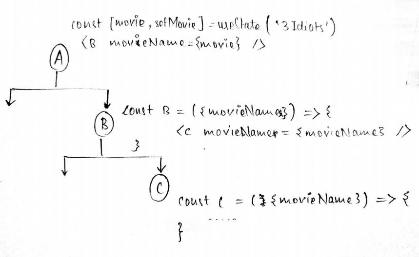

# State Management in ReactJS
When I am building a React app using hooks:
1. locally: useState()
2. Passing from parent to child: using props
3. Globally: useContext()
4. Rest APIs: useQuery(), usePaginatedQuery()

## Resources
1. [Leigh Halliday](https://www.youtube.com/watch?v=FzlurzsCW4M)
2. [Dev Ed](https://www.youtube.com/watch?v=35lXWvCuM8o&t=205s)
3. [React Query Tutorial - The Net Ninja](https://www.youtube.com/playlist?list=PL4cUxeGkcC9jpi7Ptjl5b50p9gLjOFani)

## App state
Keep state as low as possible.

1. **Local State** ... `useState() hook` is used inside the functional component locally

2. **Lift state** ... process when the local state comes one level above its original in the hierarchy ... to send in states and its setter function as props

3. **Global State (with contexts)** ... use this when the number of levels is n-level and you dont know how many ... it will get hard to re-factor

**The problem with useContext()**
Is that when you change the state, then all the components that uses that context is re-rendered.

4. On memoising a component it wont have unnecessary rerenders

Once you are uding global state, you're welcome to use MobX, Redux, Overmind, Zustand, Recoil, etc... or just stick with `useState()`.

## External Data

Dont like to save it in state and manage it myself, cause there is a lot to do like loading states, error states, the actual data you have loaded, when do u trigger updates to that state, caching issues, etc.

Some good libraries that have done all this for us:
1. React Query, SWR (when dealing with rest APIs)
2. Apollo Client, Urql (when dealing with graphQL)

## React Query

Gives tools for state management for asynchronous data that we might use, that may be from REST API, GraphQL

Does this by providing a custom hook in react called useQuery() and that manages lot of stuff under the hood for us like:

1. Caching the data after the initial fetch, which will speed up the process and give us better user experience

2. Re-fetching data in the background, so our site is always in sync with the data

3. Also gives us access to information of the request that we make like its status or any errors
